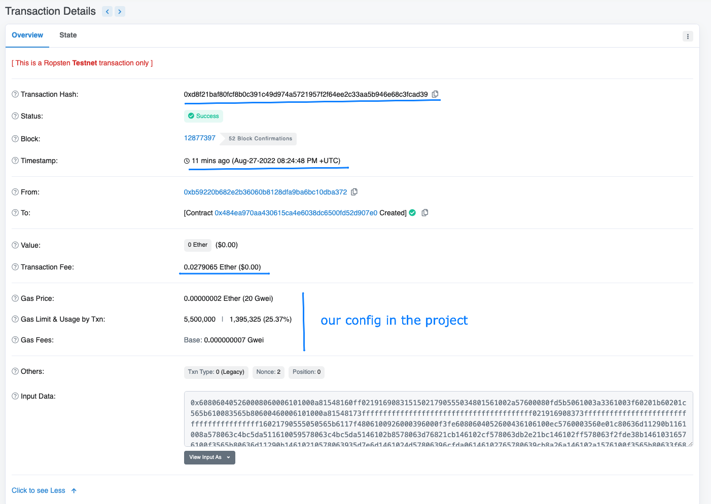

# How to deploy the project in influra and ropsten network

1. Add the nex config in your `truffle-config.js` under `networks`

```
ropsten: {
            provider: () =>
                new HDWalletProvider({
                    mnemonic: {
                        phrase: ''
                    },
                    providerOrUrl:
                        'https://ropsten.infura.io/v3/YOUR-PROJECT-ID', // --> step 2
                    addressIndex: 0 // --> Replace for number in step 4
                }),
            network_id: 3, // repsten id is 3, you can check it in Google
            gas: 5500000, // Gas limit, how much gas we are willing to spent
            /**
             * how much we are willing to spent for unit of gas
             * you can check the gas price here: https://etherchain.org/tools/gasnow
             * right now that price is 10 Gwei for fast transactions.
             * This value depends on how fast our transaction  will be in the chain
             */
            gasPrice: 20000000000,
            /**
             * Number of blocs to wait until deployment another contract
             */
            confirmations: 2,
            /**
             * Number of blocks before deployment times out
             */
            timeoutBlocks: 200
        }
```

2. Create/Login in your influra account to get:
    - `YOUR-PROJECT-ID` from influra
3. Connect to ropsten network with truffle
    ```bash
    truffle console --network ropsten
    ```
4. Get the accounts:

    ```bash
    > const accounts = await web3.eth.getAccounts()
    // Check the index account is to deploy configuration
    > account
    // or check the account balance
    > await web3.eth.getBalance(accounts[YOUR_INDEX_ACCOUNT])
    ```

5. Then, if you have all items in your config you can run:

    ```bash
    truffle migrate --network ropsten
    ```

    You will have this output

    ```bash
     Compiling your contracts...
     ===========================
     > Compiling ./contracts/CourseMarketPlace.sol
     > Artifacts written to /Users/cristianronda/Documents/CR/marketplace-eth/public/contracts
     > Compiled successfully using:
     - solc: 0.8.12+commit.f00d7308.Emscripten.clang
     WARNING: Ganache forking only supports EIP-1193-compliant providers. Legacy support for send is currently enabled, but will be removed in a future version _without_ a breaking change. To remove this warning, switch to an EIP-1193 provider. This error is probably caused by an old version of Web3's HttpProvider (or ganache < v7)


     Migrations dry-run (simulation)
     ===============================
     > Network name:    'ropsten-fork'
     > Network id:      3
     > Block gas limit: 30028271 (0x1ca31ef)


     1_initial_migration.js
     ======================

     Deploying 'Migrations'
     ----------------------
     > block number:        12877385
     > block timestamp:     1661631798
     > account:             0xB59220b682E2b36060B8128DFA9ba6Bc10dBA372
     > balance:             0.49499716
     > gas used:            250142 (0x3d11e)
     > gas price:           20 gwei
     > value sent:          0 ETH
     > total cost:          0.00500284 ETH

     -------------------------------------
     > Total cost:          0.00500284 ETH


     2_makertplace_migration.js
     ==========================

     Deploying 'CourseMarketPlace'
     -----------------------------
     > block number:        12877387
     > block timestamp:     1661631800
     > account:             0xB59220b682E2b36060B8128DFA9ba6Bc10dBA372
     > balance:             0.4661724 // --> balance after deploy in our deloyment account
     > gas used:            1395325 (0x154a7d)
     > gas price:           20 gwei
     > value sent:          0 ETH
     > total cost:          0.0279065 ETH // --> Total cost in ETH to deploy 🚀

     -------------------------------------
     > Total cost:           0.0279065 ETH

     Summary
     =======
     > Total deployments:   2
     > Final cost:          0.03290934 ETH


     Starting migrations...
     ======================
     > Network name:    'ropsten'
     > Network id:      3
     > Block gas limit: 30027247 (0x1ca2def)


     1_initial_migration.js
     ======================

     Deploying 'Migrations'
     ----------------------
     > transaction hash:    0xd8e319661e515b9f6f2441b9ad2d61fba49f35e7049b8b7b050f22fd38ecf869
     > Blocks: 2            Seconds: 14
     > contract address:    0x01B59EcDD75F46f5089eaB6362d8329f7c2cEA8f
     > block number:        12877391
     > block timestamp:     1661631816
     > account:             0xB59220b682E2b36060B8128DFA9ba6Bc10dBA372
     > balance:             0.49499716
     > gas used:            250142 (0x3d11e)
     > gas price:           20 gwei
     > value sent:          0 ETH
     > total cost:          0.00500284 ETH

     Pausing for 2 confirmations...

     -------------------------------
     > confirmation number: 1 (block: 12877392)
     > confirmation number: 2 (block: 12877393)
     > Saving migration to chain.
     > Saving artifacts
     -------------------------------------
     > Total cost:          0.00500284 ETH


     2_makertplace_migration.js
     ==========================

     Deploying 'CourseMarketPlace'
     -----------------------------
     > transaction hash:    0xd8f21baf80fcf8b0c391c49d974a5721957f2f64ee2c33aa5b946e68c3fcad39
     > Blocks: 2            Seconds: 32
     > contract address:    0x484ea970Aa430615CA4e6038Dc6500Fd52D907E0
     > block number:        12877397
     > block timestamp:     1661631888
     > account:             0xB59220b682E2b36060B8128DFA9ba6Bc10dBA372
     > balance:             0.4661724
     > gas used:            1395325 (0x154a7d)
     > gas price:           20 gwei
     > value sent:          0 ETH
     > total cost:          0.0279065 ETH

     Pausing for 2 confirmations...

     -------------------------------
     > confirmation number: 1 (block: 12877398)
     > confirmation number: 2 (block: 12877399)
     > Saving migration to chain.
     > Saving artifacts
     -------------------------------------
     > Total cost:           0.0279065 ETH

     Summary
     =======
     > Total deployments:   2
     > Final cost:          0.03290934 ETH`
    ```

6. You can check if your contract is up in the block chain here: [https://ropsten.etherscan.io/](https://ropsten.etherscan.io/)
   You have to get your contract address, to get it go to `CONTRACT_NAME.json` for this case it is in `public/contracts/CourseMarketPlace.json` under networks/3 and the address is: `0x484ea970Aa430615CA4e6038Dc6500Fd52D907E0`
   
   **For this deploy in ropsten it cost us 0.0279065ETH that will be 41,15USD (for 08/27/22) in this deploy.**
   **Remember these values would be change when we deploy to other network like Etherium Mainnet**
   When you deployed an contract out the test network you can check it here [https://etherscan.io/contractsVerified ](https://etherscan.io/contractsVerified)
